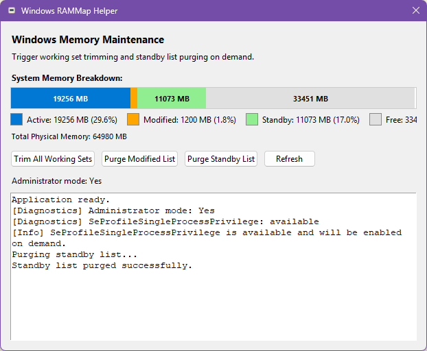

# Windows RAMMap Helper

Simple Windows GUI application to manually trigger system memory management operations.



## Features

- **System Tray Integration**: Minimize-to-tray functionality with double-click to restore.
- **Real-Time Memory Visualization**: Color-coded memory breakdown bar updated every 2 seconds.
  - Active (blue): In-use process memory.
  - Modified (orange): Changed pages awaiting disk-write.
  - Standby (green): Cached memory ready to be repurposed.
  - Free (gray): Available memory.
- **One-Click Memory Operations**: 
  - Trim all working sets.
  - Purge modified page list.
  - Purge standby list.
- **Accurate Memory Statistics**: Uses `NtQuerySystemInformation` API with `SYSTEM_MEMORY_LIST_INFORMATION` (same method as Sysinternals RAMMap).
- **Single Instance Protection**: Prevents multiple instances using Windows mutex.
- **Automatic UAC Elevation**: Requests administrator privileges on launch.
- **Non-Blocking Execution**: All memory operations run in background threads.
- **Privilege Diagnostics**: Checks and reports `SeProfileSingleProcessPrivilege` status.

## Requirements

- Windows 10/11.
- Python 3.10+.
- Administrator privileges (recommended for full functionality).
- Dependencies:
  - `psutil>=5.9.0` - memory statistics and process enumeration.
  - `pystray>=0.19.0` - system tray integration.
  - `pillow>=10.0.0` - image processing for tray icon.

## Installation

### From Source

```bash
python -m venv .venv
.venv\Scripts\activate
pip install -r requirements.txt
python run.py
```

### Build Standalone Executable

```bash
pip install -r requirements.txt
pyinstaller windows-rammap.spec
```

Output: `dist\windows-rammap.exe` (single executable, no Python installation required).

## Usage

### Launching

- Run `python run.py` or execute `windows-rammap.exe`
- Application automatically requests UAC elevation.
- Single instance enforcement prevents duplicate launches.
- Main window appears with system tray icon.

### System Tray

- **Show Window**: Double-click tray icon or right-click → Show.
- **Hide Window**: Click the window close button (X).
- **Exit Application**: Right-click tray icon → Exit.

### Memory Operations

All operations run in background threads and refresh the display automatically:

- **Trim All Working Sets**: Iterates through all processes and releases their working set memory to the standby list. Uses `EmptyWorkingSet` API call.
- **Purge Modified List**: Flushes all modified memory pages to disk using `NtSetSystemInformation` with `MEMORY_FLUSH_MODIFIED_LIST` command.
- **Purge Standby List**: Clears the standby cache (file cache) using `NtSetSystemInformation` with `MEMORY_PURGE_STANDBY_LIST` command.
- **Refresh**: Manually refresh memory statistics (auto-refreshes every 2 seconds).

### Administrator Privileges

The application works in two modes:

- **With Admin Rights**: Full functionality with accurate memory statistics (Active, Modified, Standby, Free).
- **Without Admin Rights**: Limited functionality - Modified and Standby display as 0 (unavailable), memory operations will fail.

Administrator mode is automatically checked on launch and displayed in the UI.

## Technical Details

### Memory Statistics API

The application uses Windows Native API calls for accurate memory information:

- `NtQuerySystemInformation(SystemBasicInformation)` - Gets page size and total physical pages.
- `NtQuerySystemInformation(SystemPerformanceInformation)` - Gets available pages.
- `NtQuerySystemInformation(SystemMemoryListInformation)` - Gets detailed memory list counts (modified, standby by priority).

This is the same approach used by Sysinternals RAMMap for accurate memory breakdown.

### Privilege Requirements

Memory operations require `SeProfileSingleProcessPrivilege`:

- Automatically enabled when available in the process token.
- Checked at startup with diagnostic logging.
- Missing privilege causes operations to fail with `STATUS_PRIVILEGE_NOT_HELD` error.

### Window Management

- Window close button hides to tray instead of exiting.
- Minimize button is disabled (Windows only) to encourage tray usage.
- Window icon matches executable icon (`rammap.ico`).

## Notes

- Memory operations may temporarily impact system performance as the OS reorganizes memory.
- Purging standby list will clear file cache, potentially slowing down subsequent file access.
- Administrator privileges are strongly recommended for accurate statistics and successful operations.
- The application uses Windows-specific APIs and is not compatible with other operating systems.
